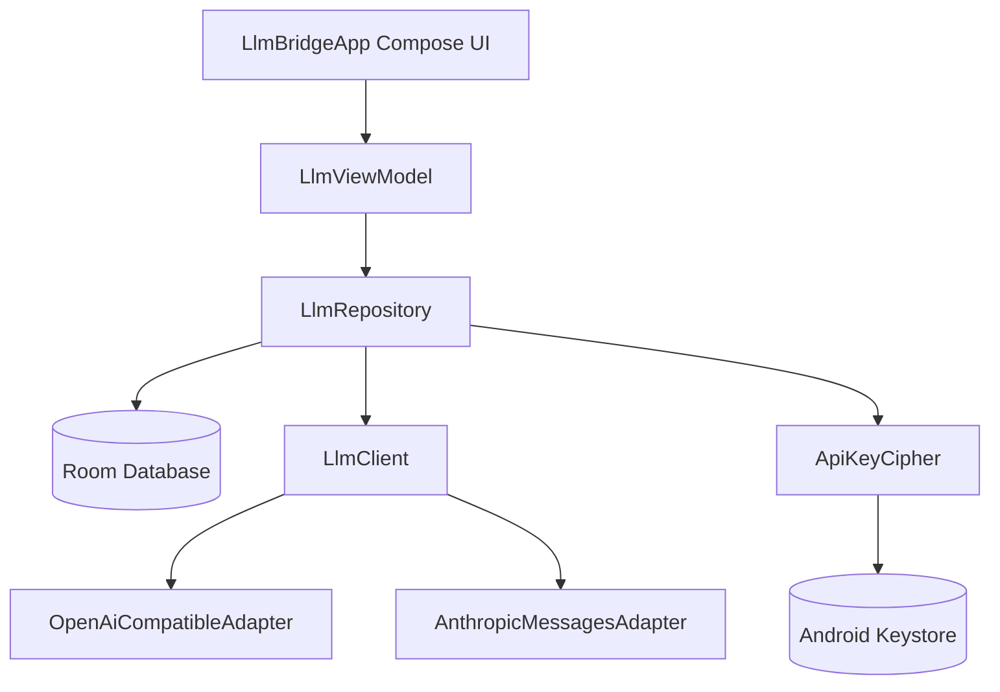

# LLM Bridge

[](#)
[](#)
[](#)
[](#)
[](#)

LLM Bridge is a local-first Android chat app for bringing your own LLM provider keys, endpoints, and model names. It is provider-agnostic by design: configure a route, choose the active model, tune request settings, and chat without sending configuration data through a hosted middle layer.

---

## Features

* **Manual Provider Routes**
  Configure OpenAI-compatible APIs or Anthropic Messages endpoints with your own base URL, API key, model name, system prompt, temperature, max tokens, and streaming preference.
* **Local-First Storage**
  Routes, chat sessions, messages, attachment metadata, and diagnostics are persisted locally in Room.
* **Keystore-Backed Key Encryption**
  API keys are encrypted before database persistence using AES-GCM keys backed by the Android Keystore system.
* **Route-Scoped Conversations**
  Each provider route owns its own chat sessions, keeping conversations tied to the model configuration that created them.
* **Session-Scoped Diagnostics**
  Request/response diagnostics, HTTP status, latency, and payload snippets are stored per chat session and shown from the active conversation overflow menu.
* **Streaming Chat**
  Server-Sent Events support streams assistant responses chunk by chunk, while stopped generations keep the partial assistant response.
* **Retry and Attachments**
  Retry the latest prompt using the current active route, and preserve user-message attachment metadata for multimodal OpenAI-compatible requests.
* **Markdown Rendering**
  Assistant messages render common Markdown structures, including headings, emphasis, lists, tables, and syntax-highlighted code blocks.

---

## Architecture and Component Mapping

The application keeps network adaptation, persistence, key encryption, and Compose UI responsibilities separated:



### Key Modules & Files

* **API & Networking Layer**
  * **[LlmClient](app/src/main/java/com/example/api/LlmClient.kt)**: Executes chat operations and delegates request/response translation to the selected protocol adapter.
  * **[LlmAdapter](app/src/main/java/com/example/api/adapter/LlmAdapter.kt)**: Defines adapter contracts, model capability flags, and provider metadata shapes.
  * **[OpenAiCompatibleAdapter](app/src/main/java/com/example/api/adapter/OpenAiCompatibleAdapter.kt)**: Builds OpenAI-compatible chat payloads, including streaming and multimodal content parts.
  * **[AnthropicMessagesAdapter](app/src/main/java/com/example/api/adapter/AnthropicMessagesAdapter.kt)**: Builds requests for Anthropic's Messages API format.
  * **[JsonWire](app/src/main/java/com/example/api/adapter/JsonWire.kt)**: Contains JSON stream parsing and payload extraction helpers.

* **Local Storage & Security Layer**
  * **[AppDatabase](app/src/main/java/com/example/data/AppDatabase.kt)**: Room database definition and migration path from schema version `1` through `7`.
  * **[LlmDao](app/src/main/java/com/example/data/LlmDao.kt)**: Data access methods for routes, sessions, messages, and diagnostics.
  * **[LlmRepository](app/src/main/java/com/example/data/LlmRepository.kt)**: Coordinates persistence, snapshots, restore flows, and API key encryption/decryption.
  * **[ApiKeyCipher](app/src/main/java/com/example/data/ApiKeyCipher.kt)**: Android Keystore-backed AES/GCM encryption helper.
  * **[LlmConfiguration](app/src/main/java/com/example/data/LlmConfiguration.kt)**: Stores endpoint, model, protocol, request settings, encrypted key material, and active-route state.
  * **[ChatSession](app/src/main/java/com/example/data/ChatSession.kt)** and **[ChatMessage](app/src/main/java/com/example/data/ChatMessage.kt)**: Persist chat sessions, message history, and attachment metadata.
  * **[ApiLog](app/src/main/java/com/example/data/ApiLog.kt)**: Persists session-scoped request diagnostics, status codes, latency, and response summaries.

* **UI Layer**
  * **[LlmViewModel](app/src/main/java/com/example/ui/LlmViewModel.kt)**: Owns observable UI state, generation lifecycle, route/session selection, retries, snapshots, and diagnostics actions.
  * **[LlmBridgeApp](app/src/main/java/com/example/ui/LlmBridgeApp.kt)**: Main Compose shell with session list, chat pane, route context strip, overflow actions, diagnostics modal, and full-screen settings.
  * **[ChatPane](app/src/main/java/com/example/ui/ChatPane.kt)**: Message list, prompt input, attachment picker, send/stop controls, copy behavior, and retry affordance.
  * **[ProviderSettingsPane](app/src/main/java/com/example/ui/ProviderSettingsPane.kt)**: Full-screen route editor for endpoint, model, API key, system prompt, temperature, max tokens, and streaming settings.
  * **Theme configuration**: Colors and typography live in **[Color.kt](app/src/main/java/com/example/ui/theme/Color.kt)**, **[Theme.kt](app/src/main/java/com/example/ui/theme/Theme.kt)**, and **[Type.kt](app/src/main/java/com/example/ui/theme/Type.kt)**.

---

## Technology Stack and Dependencies

* **Language**: Kotlin 2.2.10
* **Android**: min SDK 24, target SDK 36, compile SDK 36.1
* **Toolkit**: Jetpack Compose with Material Design 3
* **Local Database**: Room over SQLite
* **Networking**: OkHttp for HTTP and SSE streams
* **JSON Parsing**: `org.json`
* **Security**: Android Keystore with AES-GCM
* **Tests**: JUnit 4, Robolectric, Compose UI test APIs, and Roborazzi

---

## Getting Started

### Prerequisites

* Android Studio Ladybug or newer
* JDK 17 or newer
* Android SDK 36 with minor API level 1

### Building and Running

1. Clone the repository.
2. Open the project directory in Android Studio.
3. Sync Gradle.
4. Run the `:app` configuration on an Android emulator or physical device running API level 24 or newer.

Command-line checks:

```sh
./gradlew :app:testDebugUnitTest --console=plain
./gradlew :app:compileDebugKotlin --console=plain
```

### Configuring a Route

1. Open settings from the top bar.
2. Add a route with the provider base URL, protocol type, API key, and exact model name.
3. Set optional request parameters such as system prompt, temperature, max tokens, and streaming.
4. Save the route and start chatting from the main screen.

Route names are generated from the host and model name so long provider model slugs remain visible in the dedicated route context strip below the top bar.
