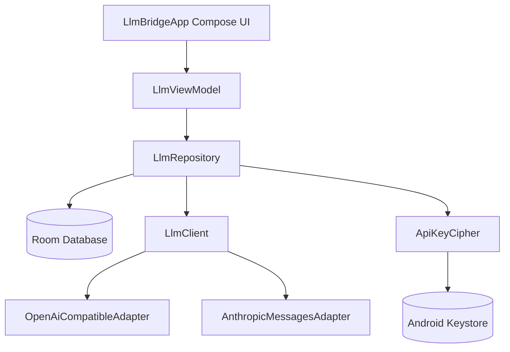

# 🌉 LLM Bridge

LLM Bridge is a professional Android application designed for configuring custom LLM provider routes, securely encrypting and storing API keys locally, and interacting with active model endpoints through a responsive, feature-rich chat interface.

---

## 🎨 Screenshot Preview

Below is a visual preview of the LLM Bridge application interface:

---

## ✨ Features

* **Flexible Endpoint Routing**
  Configure connections to any OpenAI-compatible API or native Anthropic endpoint. Easily integrate with:
  * Official endpoints (OpenAI, Anthropic)
  * Local providers (Ollama via Android emulator host aliases)
  * Hosted integrations (NVIDIA NIM/Integrate, DeepSeek, GLM, Moonshot, MiniMax)
* **Keystore-Backed Key Encryption**
  All API keys are securely encrypted using GCM-authenticated AES transformations backed by the **Android Keystore system** prior to DB persistence.
* **Real-time SSE Streaming**
  Support for Server-Sent Events (SSE) allows streaming chat responses chunk-by-chunk in real-time.
* **Markdown Rendering**
  High-fidelity presentation support for headers, bold/italics, bulleted lists, tables, and copyable syntax-highlighted code blocks.
* **Call Diagnostics & Latency Tracking**
  Built-in logging engine tracks round-trip connection latencies, HTTP status codes, request bodies, and response payloads.

---

## 🏗️ Architecture & Component Mapping

The application follows a clean separation of concerns, isolating network and translation layers from database schemas and the UI layer:

### Key Modules & Files

* **API & Networking Layer**
  * **[LlmClient](file:///home/kiran/llm-bridge/app/src/main/java/com/example/api/LlmClient.kt)**: The central entry point for executing chat operations. Routes request payloads to the corresponding protocol adapter.
  * **[LlmAdapter](file:///home/kiran/llm-bridge/app/src/main/java/com/example/api/adapter/LlmAdapter.kt)**: Establishes adapters templates, capability flags (`ModelCapability`), and metadata representations (`ModelOffering`, `AccessTier`).
  * **[OpenAiCompatibleAdapter](file:///home/kiran/llm-bridge/app/src/main/java/com/example/api/adapter/OpenAiCompatibleAdapter.kt)**: Adapt requests for generic OpenAI endpoints, including stream chunking, tool setups, and base64-encoded multimodal inputs.
  * **[AnthropicMessagesAdapter](file:///home/kiran/llm-bridge/app/src/main/java/com/example/api/adapter/AnthropicMessagesAdapter.kt)**: Manages communication formatting for Anthropic's `/messages` structure.
  * **[JsonWire](file:///home/kiran/llm-bridge/app/src/main/java/com/example/api/adapter/JsonWire.kt)**: Helpers for processing JSON stream lines, payload merges, and extraction routines.

* **Local Storage & Security Layer**
  * **[AppDatabase](file:///home/kiran/llm-bridge/app/src/main/java/com/example/data/AppDatabase.kt)**: SQLite interface backing the Room schema. Defines data migration schemas (`1` to `6`).
  * **[LlmDao](file:///home/kiran/llm-bridge/app/src/main/java/com/example/data/LlmDao.kt)**: Data access objects for CRUD operations on configurations, chats, sessions, and logs.
  * **[LlmRepository](file:///home/kiran/llm-bridge/app/src/main/java/com/example/data/LlmRepository.kt)**: Coordinates data retrieval and enforces runtime key encryption/decryption.
  * **[ApiKeyCipher](file:///home/kiran/llm-bridge/app/src/main/java/com/example/data/ApiKeyCipher.kt)**: Keystore-backed symmetric encryption utility (`AES/GCM/NoPadding`).
  * **[LlmConfiguration](file:///home/kiran/llm-bridge/app/src/main/java/com/example/data/LlmConfiguration.kt)**: Stores base URL, key hashes, target model flavor, max tokens, custom body overrides, and active status.
  * **[ChatSession](file:///home/kiran/llm-bridge/app/src/main/java/com/example/data/ChatSession.kt)** & **[ChatMessage](file:///home/kiran/llm-bridge/app/src/main/java/com/example/data/ChatMessage.kt)**: Store session names and messages history.
  * **[ApiLog](file:///home/kiran/llm-bridge/app/src/main/java/com/example/data/ApiLog.kt)**: Persists connection latencies, HTTP status codes, payloads, and response diagnostics.

* **UI Layer**
  * **[LlmViewModel](file:///home/kiran/llm-bridge/app/src/main/java/com/example/ui/LlmViewModel.kt)**: Manages StateFlow state streams, handles asynchronous side-effects, manages loading/error structures, and interacts with repository operations.
  * **[LlmBridgeApp](file:///home/kiran/llm-bridge/app/src/main/java/com/example/ui/LlmBridgeApp.kt)**: Composable layout containing the settings drawer, message lists, logging viewports, and custom Markdown formatting renderer.
  * **Theme configuration**: Handles colors and typographic styling setups via **[Color.kt](file:///home/kiran/llm-bridge/app/src/main/java/com/example/ui/theme/Color.kt)**, **[Theme.kt](file:///home/kiran/llm-bridge/app/src/main/java/com/example/ui/theme/Theme.kt)**, and **[Type.kt](file:///home/kiran/llm-bridge/app/src/main/java/com/example/ui/theme/Type.kt)**.

---

## 🛠️ Technology Stack & Dependencies

* **Language**: Kotlin 2.2.10 (with Kotlin Coroutines for concurrency)
* **Toolkit**: Jetpack Compose (Material Design 3 Components)
* **Local Database**: Room persistence library (SQLite)
* **Networking**: OkHttp Client for reliable HTTP and SSE streams
* **JSON Parsing**: Native `org.json` implementation
* **Security**: Android Keystore Provider (AES-GCM 128-bit keys)
* **Test Runners**: JUnit 4, Robolectric, and Roborazzi (visual screenshot verification)

---

## 🚀 Getting Started

### Prerequisites

* Android Studio (Ladybug or newer recommended)
* JDK 17+ configured
* Android SDK 36 (minor API level 1)

### Building and Running

1. Clone or copy this repository to your local machine.
2. Open the directory `/home/kiran/llm-bridge` in Android Studio.
3. Sync the project with Gradle files (`build.gradle.kts` and `settings.gradle.kts` will auto-configure).
4. Run the `:app` configuration on an Android Emulator or a connected physical device running API level 24 or newer.

> [!NOTE]
> If building via the command line, make sure you configure your local Gradle instance or generate a new wrapper using Android Studio's terminal.
